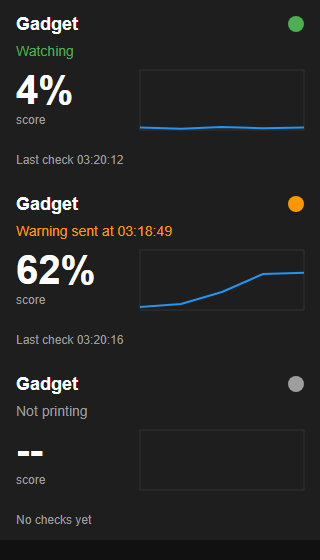

# Gadget Camera

Shows OctoEverywhere's [Gadget](https://octoeverywhere.com/gadget) AI print failure detection status as a live card in Fluidd or Mainsail.



Fluidd and Mainsail don't support custom cards, so this uses a camera card instead. The OctoEverywhere plugin writes a small status image, and the frontend's **MJPEG Adaptive** camera reloads it, giving a live card that doesn't replace anything else on the dashboard.

The card shows:

- **Status** - Watching, Warning sent, Paused print, Off for this print or Not printing
- **Score** - the latest Gadget score
- **History** - a graph of the score over the current print
- **Last check** - the time Gadget last checked the print

## How it works

The card is redrawn when Gadget starts or stops watching a print, and each time it gets a result back from the OctoEverywhere server. That's about every 30 seconds while printing, the server decides the exact interval. It's written to:

```
printer_data/config/.octoeverywhere/gadget-status.svg
```

Moonraker serves it to the frontend at:

```
/server/files/config/.octoeverywhere/gadget-status.svg
```

## Files

These are the OctoEverywhere plugin files with the change added, laid out the same as the [OctoEverywhere repo](https://github.com/QuinnDamerell/OctoPrint-OctoEverywhere).

| File | Change |
|---|---|
| `moonraker_octoeverywhere/gadgetstatuscard.py` | New - draws and writes the status card |
| `moonraker_octoeverywhere/moonrakerhost.py` | Starts the card when it's enabled |
| `linux_host/config.py` | Adds the `[gadget] status_card_enabled` setting |
| `octoeverywhere/gadget.py` | Adds `IsWatching()` and a status changed callback |

Only Moonraker (Klipper) printers are supported, with OctoEverywhere installed on the printer or as an OctoEverywhere Companion. A Companion runs on another device, so it uploads the image with Moonraker's file upload API instead of writing it to the config folder.

## Install

1. On the device OctoEverywhere runs on:

   ```
   git clone https://github.com/sterling5241/gadget-camera.git ~/gadget-camera
   cd ~/gadget-camera
   sh installer.sh
   ```

   If OctoEverywhere isn't in `~/octoeverywhere`, `/usr/data/octoeverywhere`, `/usr/share/octoeverywhere` or `/mnt/UDISK/octoeverywhere`, pass the path: `sh installer.sh /path/to/octoeverywhere`

2. Add the card in Fluidd under **Settings > Cameras > Add camera**:

   | Setting | Value |
   |---|---|
   | Name | `Gadget` |
   | Service | `MJPEG Adaptive` |
   | Snapshot URL | `/server/files/config/.octoeverywhere/gadget-status.svg` |
   | Target FPS | `1` |

   Mainsail is the same under **Settings > Webcams**.

An OctoEverywhere update will replace these files, so run the installer again after updating.
